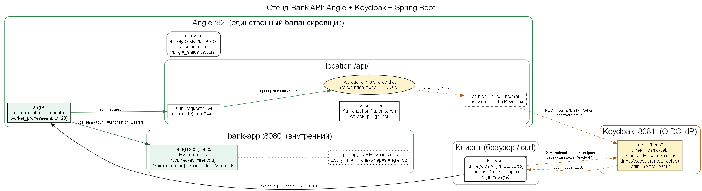
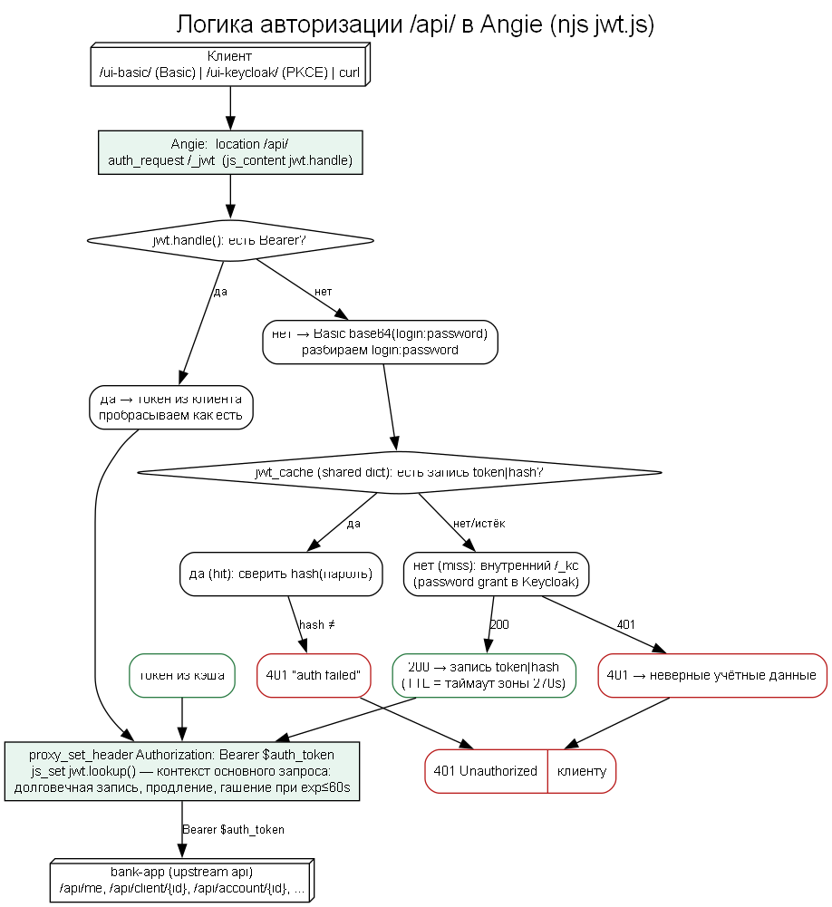
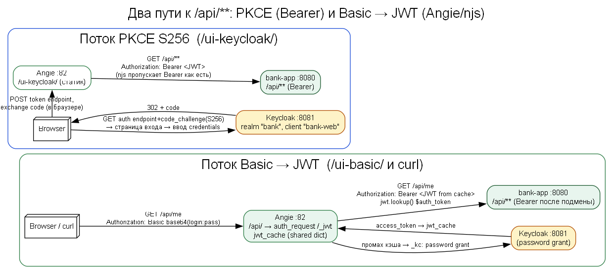

# Bank API — Angie + Keycloak

Учебный стенд: Spring Boot REST API (`bank-app`) за единственным балансировщиком **Angie**, авторизация — **Keycloak** (OIDC). Angie не только балансирует, но и конвертирует `Basic login:password` в JWT через njs-модуль, поэтому в `/api/**` можно ходить как с `Bearer`, так и с `Basic`. Все схемы стенда — текстовые (раздел «Схемы стенда»).

## Точки доступа

| Точка | URL | Описание |
|-------|-----|----------|
| Страница ссылок | `http://localhost:82/` | все точки доступа из одного места (`docker/links.html`, монтаж на `/` как `index.html`) |
| **API через Angie** | `http://localhost:82/api/...` | `/api/me`, `/api/client/{id}`, `/api/account/{id}`, `/api/client/{id}/accounts` — авторизация `Bearer` либо `Basic`; наружу `8080` не публикуется |
| Web UI (Keycloak) | `http://localhost:82/ui-keycloak/` | vanilla JS, PKCE S256, вход через Keycloak (realm `bank`) |
| Web UI (Basic) | `http://localhost:82/ui-basic/` | логин/пароль → `Basic` на Angie → JWT через njs (без редиректа на Keycloak) |
| Login Keycloak | `http://localhost:8081/realms/bank/login` | кастомная тема `bank` (баннер «Bank API» поверх нативной формы) |
| Swagger UI | `http://localhost:82/swagger-ui.html` | документация API через Angie |
| Admin Keycloak | `http://localhost:8081` | консоль админа: `admin`/`admin`; realm `bank`, клиент `bank-web` |
| Статус Angie | `http://localhost:82/angie_status` | stub_status (сессии/статистика) |
| — | `http://localhost:82/status/` | JSON API (server_zones, upstreams, connections) |
| bank-app health | `http://localhost:82/actuator/health` | health-check backend через балансировщик |
| OIDC discovery | `http://localhost:8081/realms/bank/.well-known/openid-configuration` | де-факто healthcheck Keycloak (ждёт `start_all.cmd` перед smoke) |

## Требования

Репозиторий рассчитан на **Windows 10/11**: однокомандный лаунчер `start_all.cmd`, `gradlew.bat` и PowerShell-примеры — Windows-специфичны. Ручной путь (см. «Быстрый старт») работоспособен и на Linux/macOS — там вместо `.\gradlew.bat` используется `./gradlew`, а `docker compose` команды идентичны, но полный цикл `start_all.cmd` (+ режимы `test`/`clean`) реализован только для Windows.

| Компонент | Версия | Зачем | Примечание |
|-----------|--------|-------|------------|
| Windows | 10/11 | запуск `start_all.cmd`, `.bat`-сборка, smoke через `curl.exe` | иная ОС не тестировалась |
| JDK | 21 (Temurin 21.0.x) | сборка и тесты Spring Boot-приложения | нужен только на хосте сборки; переменная `JAVA_HOME` (по умолчанию `c:\sdk\jdk-21.0.2`): `java -version` |
| Docker Desktop | актуальная с Compose v2 | весь стенд: `bank-app`, `angie-proxy`, `keycloak`, `k6-load-test` | `docker compose` — из каталога `docker/` |
| Gradle | 8.7 (обёртка, отдельно не ставится) | сборка JAR, тесты, Allure-отчёты | файл `app/gradlew.bat`; переменная `GRADLE_USER_HOME` должна указывать на ASCII-путь (кириллический профиль ломает Gradle; на этой машине — `C:\sdk\gradle-home`, подробности в `AGENTS.md`) |
| curl.exe | встроен в Windows 10+ | smoke-тесты в `start_all.cmd` | отдельная установка не нужна |
| Порты `82`, `8081` | свободные | Angie и Keycloak соответственно | занятость проверить до первого запуска |

Angie, Keycloak, k6 и Java-приложение работают только в контейнерах — отдельно устанавливать их или БД/Node.js не нужно.

## Быстрый старт

```bash
# 1. Сборка JAR (обязательна: Dockerfile копирует готовый банк, без build-стадии) — из каталога app/
cd app
.\gradlew.bat assemble --no-daemon

# 2. Запуск стенда (из каталога docker/)
cd ..\docker
docker compose up -d --build
```

Или одной командой из корня репозитория:

```powershell
.\start_all.cmd          # сборка app → compose → ожидание healthy → smoke → e2e → оба Allure-отчёта
.\start_all.cmd test     # то же + k6 нагрузочный тест
.\start_all.cmd clean    # остановить docker compose (down) + удалить все результаты сборки: app\build (JAR, тест-отчёты, Allure) и app\.gradle
```

## Контейнеры

| Container | Port | Purpose |
|-----------|------|---------|
| bank-app | 8080 (внутр.) | Spring Boot API — `/api/**` требует авторизацию, подпись JWT не проверяется. **Порт наружу не публикуется: доступ к API только через Angie `:82`** |
| angie-proxy | 82 | балансировщик + Web UI + статусы (`/angie_status`, `/status/`) + links page `/` |
| keycloak | 8081 | OIDC IdP, realm `bank`, клиент `bank-web` (PKCE + password grant, `start-dev --import-realm`, без volume — realm пересоздаётся при рестарте); кастомная login-тема `bank` (`docker/keycloak/themes/bank/`) |
| k6-load-test | — | нагрузочный тест (профиль `test`) |

## API и авторизация

| Метод | URL | Описание |
|-------|-----|----------|
| GET | `/api/me` | текущий пользователь из JWT (`username`, `clientId`) |
| GET | `/api/client/{id}` | данные клиента |
| GET | `/api/account/{id}` | счёт по ID |
| GET | `/api/client/{id}/accounts` | счета клиента |

JWT: UI и k6 получают access token из Keycloak; API берёт из Bearer `preferred_username`/`sub` и `client_id` (демо — подпись JWT не проверяется). Без `Authorization` — `401`.

Заголовок `Authorization`:

- `Bearer <JWT>` — токен из Keycloak (password grant или PKCE), проксируется на API как есть;
- `Basic base64(login:password)` — Angie (модуль njs) сама получает JWT: при промахе кэша выполняет Keycloak password grant, сохраняет access-токен в shared-словаре (`jwt_cache`, запись `token|hash`) и подменяет заголовок на `Bearer`. Запись живёт по таймауту зоны (`270s`), продлевается на каждом Basic-запросе при остатке жизни токена >60 с; на исходе срока гасится, и следующий запрос перевыпускает токен. Повторные запросы обслуживаются из кэша без обращения к Keycloak. Неверные учётные данные → 401 — даже для закэшированного пользователя (njs сверяет `hash(пароль)`).

Все обращения к `/api/**` логируются в логе `bank-app`: метод, URI, пользователь из JWT, **поступивший JWT-токен** (`token=<raw>`), HTTP-статус, длительность: `docker compose logs -f bank-app`.

Тестовые пользователи (realm `bank`):

| Login | Password | client_id (claim) | Назначение |
|-------|----------|-------------------|------------|
| ivanov | password123 | 1 | демо: Web UI, примеры запросов |
| petrova | password456 | 2 | демо: Web UI, негатив «неверный пароль» |
| testuser | testpass123 | 1 | **автотесты** (e2e, smoke `start_all.cmd`, k6) — отдельный пользователь, чтобы не смешивать тестовый трафик с демо в JWT-логе и кэше njs |

### Web UI

- **`/ui-keycloak/`** — вход через Keycloak (PKCE S256). Кнопка «Выйти» сначала отзывает refresh-токен через `/realms/bank/protocol/openid-connect/revoke` (RFC 7009 — деактивирует и связанный access-токен на стороне Keycloak), затем завершает SSO-сессию через `/protocol/openid-connect/logout` и возвращает на страницу входа.
- **`/ui-basic/`** — без Keycloak-редиректа: логин/пароль уходят как `Basic` на Angie, который сам получает и кэширует JWT. Неверные логин/пароль → сообщение об ошибке на форме; пустые поля → «Введите логин и пароль.». «Выйти» очищает только сохранённые учётные данные браузера (JWT живёт в Angie до `exp`).

### Примеры запросов

```powershell
# Bearer (токен из Keycloak)
$TOKEN = (Invoke-RestMethod -Method Post -Uri "http://localhost:8081/realms/bank/protocol/openid-connect/token" `
  -ContentType "application/x-www-form-urlencoded" `
  -Body "grant_type=password&client_id=bank-web&username=testuser&password=testpass123").access_token
curl http://localhost:82/api/me -H "Authorization: Bearer $TOKEN"

# Basic (Angie сама получает и кэширует JWT)
curl http://localhost:82/api/me -u testuser:testpass123
curl http://localhost:82/api/client/1 -u testuser:testpass123
curl http://localhost:82/api/account/1 -u petrova:WRONG   # -> 401 (неверный пароль отклоняется)
```

## Как Angie работает с JWT (Basic → Bearer): разбор по файлам

### Маршрут запроса по шагам

1. Браузер/curl → `GET /api/**` → Angie `:82`.
2. `location /api/` (`conf.d/default.conf`) выполняет `auth_request /_jwt` — внутренний subrequest авторизации. Ответ subrequest управляет доступом: **200 → пропускаем, 401/403 → клиенту сразу `401`** (тело и заголовки subrequest на upstream не передаются).
3. Внутренний `location = /_jwt` (`internal`, наружу недоступен) обрабатывается njs-функцией `js_content jwt.handle`.
4. `jwt.handle()` (`js/jwt.js`) разбирает `Authorization`:
   - `Bearer ...` → сразу `200` (пропускаем как есть);
   - без заголовка → `401`;
   - `Basic base64(login:password)` → проверка кэша `jwt_cache`:
     - **hit** → сверка `hash(пароль)`: совпал → `200`, не совпал → `401 auth failed`;
     - **miss** → внутренний subrequest `/_kc` (Keycloak password grant) → токен пишется в кэш → `200`, либо `401` (неверные учётные данные).
5. При `200` Angie подставляет на апстрим `proxy_set_header Authorization $auth_token` — njs-переменную, вычисленную `js_set jwt.lookup` синхронно из shared-словаря.
6. `jwt.lookup()`: `Bearer` из клиента → как есть; `Basic` → `Bearer <токен из jwt_cache>`.
7. `bank-app:8080` видит только `Authorization: Bearer <JWT>` — приложение ничего не знает о Basic и кэше.

### Файлы и их назначение

| Файл | Где | Что делает |
|------|-----|------------|
| `docker/angie/Dockerfile` | исходный | Базовый образ `docker.angie.software/angie:latest` (Angie с полным набором модулей — njs уже внутри), `EXPOSE 82`, `CMD angie -g "daemon off;"`. Отдельной установки njs нет. |
| `docker/angie/angie.conf` | монтируется в `/etc/angie/angie.conf:ro` | Глобальный конфиг: `load_module .../ngx_http_js_module.so` (динамический модуль njs), `js_import jwt from /etc/angie/js/jwt.js` (импорт скрипта → `jwt.handle`/`jwt.lookup`), `js_shared_dict_zone zone=jwt_cache:1m timeout=270s` (shared-словарь: 1 МБ, TTL записи = 270 с ≈ `exp` токена − 30 с), `js_set $auth_token jwt.lookup` (njs-переменная для заголовка), `include /etc/angie/conf.d/*.conf`. |
| `docker/angie/conf.d/default.conf` | монтируется в `/etc/angie/conf.d:ro` | Vhost `:82`. Ключевое для JWT: `location /api/` (`auth_request /_jwt` + `proxy_pass http://bank-app:8080` + `proxy_set_header Authorization $auth_token`), `location = /_jwt` (`internal; js_content jwt.handle;`), `location = /_kc` (`internal; proxy_pass http://keycloak:8080/realms/bank/protocol/openid-connect/token; proxy_set_header Content-Type application/x-www-form-urlencoded;`). Отладка: `location = /_jwt_stats` (`js_content jwt.stats` — сколько токенов в кэше). Остальное — статика `/`, `/ui-keycloak/`, `/ui-basic/`, swagger, `/angie_status`, `/status/`. |
| `docker/angie/js/jwt.js` | монтируется в `/etc/angie/js:ro` | Логика njs (ES5): `handle(r)` — auth-субреквест (200/401, кэш, сверка hash, password grant), `lookup(r)` — значение `$auth_token` для апстрима (в контексте основного запроса пере-пишет/продлит запись, гасит её при `exp ≤ 60 с`), `stats(r)` — отладка кэша (`jwt_cache.keys()`), `hash(s)` — SHA-256 (`require('crypto')`, fallback FNV-1a 32-bit), `expires(tok)` — считывает `exp` из payload JWT, `enc(s)` — URL-энкодинг login/password, `userFrom(auth)` — login из Basic. |
| `docker/docker-compose.yml` | оркестрация | Сервис `angie-proxy`: порт `82:82`, монтажи `./angie/angie.conf`, `./angie/conf.d`, `./angie/js`, `./links.html`→`index.html`, `./ui-keycloak`, `./ui-basic`; healthcheck `wget http://127.0.0.1:82/angie_status` (IPv4 — Angie не слушает `::1`); `depends_on: bank-app: service_healthy`. Правки конфигов применяются без пересборки образа (volume-монтаж), но после изменения `angie.conf`/`jwt.js` нужен reload: `docker exec angie-proxy angie -s reload`. |

### Важные ограничения этого стенда

- `$upstream_http_*` НЕ работает для `js_content` — только для реального апстрима. Поэтому токен к апстриму передаётся через njs-переменную `$auth_token` из shared-словаря, а не через заголовок subrequest.
- njs в этом образе — ES5: нет `fetch`, `for..of`, `ngx.encodeBase64`; base64-операции — через `Buffer.from(..., 'base64')`.
- Кэш живёт по таймауту зоны (270 с), продлевается при каждом Basic-запросе, пока токену остаётся >60 с; на исходе срока запись гасится и токен перевыпускается. Неверный пароль отклоняется **даже при попадании в кэш** (сверяется `hash(пароль)`).
- Проверка подписи JWT на апстриме не выполняется (демо) — читается только payload.

### Версии компонентов

| Компонент | Версия | Где задано / как проверить |
|-----------|--------|----------------------------|
| Angie | **1.12.2** (ядро nginx 1.31.2, OpenSSL 3.5.8, built 2026-09-17) | `docker/angie/Dockerfile` → `docker.angie.software/angie:latest`; `docker exec angie-proxy angie -V` |
| njs (ngx_http_js_module) | **1.0.1** | встроен в образ Angie (`/usr/lib/angie/modules/ngx_http_js_module.so`, `load_module` в `angie.conf`); из контейнера: `grep -a -o 'njs-[0-9.]*' /usr/lib/angie/modules/ngx_http_js_module.so` |
| Keycloak | **26.1** | `docker/docker-compose.yml` → `quay.io/keycloak/keycloak:26.1` |
| Spring Boot (bank-app) | **3.2.0** | `app/build.gradle` |
| Java (runtime bank-app) | **OpenJDK 21.0.12.1 (Temurin)** | образ bank-app; `docker exec bank-app java -version` |
| Java (сборка) | **JDK 21** | `app/build.gradle` (source/target 21); локально `JAVA_HOME=c:\sdk\jdk-21.0.2` |
| Gradle | **8.7** (wrapper) | `app/gradle/wrapper/gradle-wrapper.properties` |
| H2 | **2.2.224** | `app/build.gradle` |
| springdoc-openapi | **2.3.0** | `app/build.gradle` |
| Allure (плагин / CLI) | **2.11.2** / **2.34.0** | `app/build.gradle` |
| k6 | latest (`grafana/k6:latest`) | `docker/k6/Dockerfile` |

### Настройка Angie + JWT по шагам

Чтобы воспроизвести схему с нуля:

1. **Angie-образ с njs** — `docker/angie/Dockerfile` на базе `docker.angie.software/angie:latest`. Модуль njs (`ngx_http_js_module.so`) уже в образе — отдельная установка не нужна. Порт наружу: `82:82`.
2. **Глобальный конфиг** `docker/angie/angie.conf` (в контейнере `/etc/angie/angie.conf`) — включить и подготовить njs:
   - `load_module /usr/lib/angie/modules/ngx_http_js_module.so;` — подключить динамический модуль njs;
   - `js_import jwt from /etc/angie/js/jwt.js;` — импортировать njs-скрипт (модуль `jwt`);
   - `js_shared_dict_zone zone=jwt_cache:1m timeout=270s;` — создать shared-словарь `jwt_cache` (1 МБ, TTL записи 270 с ≈ `exp` токена 300 с − запас). **TTL задаётся именно таймаутом зоны**: передавать 3-й аргумент в `set()` нельзя (в этой сборке трактуется как миллисекунды);
   - `js_set $auth_token jwt.lookup;` — объявить njs-переменную `$auth_token` (финальный заголовок на апстрим).
3. **Vhost** `docker/angie/conf.d/default.conf`, порт 82:
   - `location /api/` → `auth_request /_jwt;` + `proxy_pass http://bank-app:8080;` + `proxy_set_header Authorization $auth_token;` — каждый `/api/**` сначала проходит внутреннюю авторизацию, затем получает заголовок `Authorization` из njs;
   - `location = /_jwt { internal; js_content jwt.handle; }` — внутренняя точка auth-проверки (наружу недоступна);
   - `location = /_kc { internal; proxy_pass http://keycloak:8080/realms/bank/protocol/openid-connect/token; proxy_set_header Content-Type application/x-www-form-urlencoded; }` — внутренний прокси Keycloak password grant.
4. **Логика njs** `docker/angie/js/jwt.js` (ES5): функции `handle`, `lookup`, `stats` + хелперы `hash`/`expires`/`enc`/`userFrom`, экспорт `export default { handle, lookup, stats }`. Долговечная запись в кэш делается в `lookup()` (контекст основного запроса) — запись из auth-subrequest `handle()` в этой сборке живёт лишь ~0,3 с.
5. **Keycloak** — клиент `bank-web` в realm `bank` должен иметь `directAccessGrantsEnabled: true` (password grant — им ходит njs в `/_kc`) и `standardFlowEnabled: true` (PKCE для `/ui-keycloak/`). Импорт realm: `docker/keycloak/bank-realm.json`, запуск `start-dev --import-realm`.
6. **Compose-монтажи** (`docker/docker-compose.yml`, сервис `angie-proxy`): `./angie/angie.conf` → `/etc/angie/angie.conf:ro`, `./angie/conf.d` → `/etc/angie/conf.d:ro`, `./angie/js` → `/etc/angie/js:ro`; healthcheck `wget http://127.0.0.1:82/angie_status` (только IPv4 — Angie не слушает `::1`); `depends_on: bank-app: condition: service_healthy`.
7. **Применить и проверить**:
   ```powershell
   docker exec angie-proxy angie -t          # синтаксис конфига
   docker exec angie-proxy angie -s reload   # перечитать конфиг
   docker compose up -d --build              # если менялся Dockerfile
   ```
   Правки `angie.conf`/`default.conf`/`jwt.js` подхватываются без пересборки образа (read-only volume), но reload обязателен.
8. **Смоук-проверка** — см. следующий раздел (401 без заголовка, Bearer→200, Basic→200, `/_jwt_stats`).

### Проверка корректной работы схемы

Стенд поднят (`.\start_all.cmd` или `docker compose up -d --build`). Быстрая самопроверка:

```powershell
# 1. Без заголовка — ожидается 401
curl.exe -s -o NUL -w "%{http_code}`n" http://localhost:82/api/me

# 2. Bearer из Keycloak — ожидается 200
$T = (Invoke-RestMethod -Method Post -Uri "http://localhost:8081/realms/bank/protocol/openid-connect/token" `
  -ContentType "application/x-www-form-urlencoded" `
  -Body "grant_type=password&client_id=bank-web&username=testuser&password=testpass123").access_token
curl.exe -s -o NUL -w "%{http_code}`n" -H "Authorization: Bearer $T" http://localhost:82/api/me

# 3. Basic (Angie сама получает и кэширует JWT) — ожидается 200
curl.exe -s -o NUL -w "%{http_code}`n" -u testuser:testpass123 http://localhost:82/api/me

# 4. Неверный пароль — ожидается 401 (даже если пользователь уже в кэше)
curl.exe -s -o NUL -w "%{http_code}`n" -u petrova:WRONG http://localhost:82/api/account/1
```

Ожидаемая последовательность кодов: `401 / 200 / 200 / 401`.

Дополнительно:

- **Smoke по всем точкам** — блок `[4/6]` в `start_all.cmd` выводит HTTP-коды всех URL (web-эндпоинты + API по Bearer и Basic).
- **E2E** — `cd app; .\gradlew.bat e2eTest --no-daemon` — 6 сценариев аутентификации через живой стенд.
- **Лог `bank-app`** — `docker compose logs -f bank-app` должен показывать `API request: ... user=testuser token=eyJ... status=200` для Basic-запросов — значит njs подставил корректного пользователя в JWT, а API залогировал сам поступивший токен.
- **Лог Angie** — `docker compose logs -f angie-proxy` покажет `401` на неверный пароль и `200` в остальных случаях.
- **Кэш njs** — смотрите следующий раздел.

### Сколько токенов сейчас в njs (jwt_cache)

Отладка кэша — endpoint Angie (njs) `http://localhost:82/_jwt_stats`:

```powershell
curl.exe -s http://localhost:82/_jwt_stats
# => {"total":1,"users":[{"user":"testuser","token":true}]}
```

Поля: `total` — сколько записей в `jwt_cache` сейчас (связок «логин → токен»), `users[]` — какие пользователи и есть ли у них токен. Endpoint доступен без авторизации, но отдаёт **только логины и признак наличия токена** — сами токены и пароли наружу не попадают.

Записи живут по таймауту зоны (`timeout=270s`; токен самого Keycloak действует 300 с), продлеваются на каждом Basic-запросе, пока токену остаётся >60 с; на исходе срока запись гасится, и следующий запрос перевыпускает свежий токен. При отсутствии Basic-запросов `total` сам спадает до 0.

**Два подводных камня njs в этой сборке Angie (найдены эмпирически):**
1. **`set()` нельзя передавать 3-м аргументом timeout** — здесь он трактуется как **миллисекунды**, а не секунды (probe: `set(..., 270)` → запись исчезает через ~0,3 с — это и был источник «размножения токенов»). TTL задаётся таймаутом зоны.
2. **Запись из auth_request-subrequest живёт ~0,3 с** даже без timeout: `handle()` (субреквест) не может сам надёжно сохранить токен — долговечная запись выполняется в `lookup()` (js_set в контексте **основного** запроса), поэтому кэш пишется/продлевается на каждом запросе.

**Про `worker_processes`: можно оставлять `auto` (20 воркеров на этой машине).** Shared-словарь реально шарится между воркерами — проверено: 100 быстрых Basic-запросов на 20 воркерах дали 1 токен, `_jwt_stats` достоверен. Более ранний вывод «worker_processes 1 обязателен» был ошибочным: все тогдашние симптомы объяснялись п.1 (TTL в миллисекундах).

Где это устроено:

- `docker/angie/js/jwt.js` → функция `stats(r)` через `ngx.shared.jwt_cache.keys(1000)` + `get`, экспортируется как `stats`;
- `docker/angie/conf.d/default.conf` → `location = /_jwt_stats { default_type application/json; js_content jwt.stats; }`.

Замечание на будущее: в сборке Angie 1.12.2 метод перечисления ключей shared-словаря называется `keys()`. В некоторых сборках njs этот метод называется `get_keys(max)` — если endpoint упадёт с `500` / `TypeError: undefined is not a function`, замените `keys(1000)` на `get_keys(1000)`.

## Статус Angie

```
http://localhost:82/angie_status   # stub_status
http://localhost:82/status/        # JSON API (server_zones, upstreams, connections)
```

## Схемы стенда

### Графические схемы (Graphviz, `diagrams/`)

> Исходники `.gv` + отрендеренные `.png` лежат в `diagrams/`. Перегенерировать PNG: `dot -Tpng -o diagrams/<name>.png diagrams/<name>.gv`.

### А. Компоненты стенда



### Б. Логика авторизации /api/ в Angie (njs)



### В. Два пути к /api/**: PKCE (Bearer) и Basic → JWT



### Текстовые схемы (ASCII)

### 1. Компоненты стенда

```text
┌──────────────────────────────────────────────────────────┐
│                         Browser                          │
│/ui-keycloak/ (PKCE S256)   →  Bearer JWT                 │
│/ui-basic/ (Basic login)    →  JWT через Angie            │
│curl:   Bearer <token>  |  Basic login:password           │
└───────────────────────────────┬──────────────────────────┘
                                │ HTTP
                                ▼
┌──────────────────────────────────────────────────────────┐
│                        Angie :82                         │
│balancer + njs (ngx_http_js_module)                       │
│API /api/** → ТОЛЬКО здесь (порт 8080 закрыт)             │
│location /api/  →  auth_request /_jwt (js jwt.handle)     │
│jwt_cache: njs shared dict (token|hash, zone TTL 270s)    │
│/_kc  →  password grant в Keycloak (только промах)        │
│статика: /ui-keycloak/, /ui-basic/, /, /swagger-ui        │
│статусы: /angie_status, /status/ (JSON)                   │
└───────────────────────────────┬──────────────────────────┘
                                │ upstream api (Authorization: Bearer)
                                ▼
┌──────────────────────────────────────────────────────────┐
│                bank-app :8080 (internal)                 │
│Spring Boot (Tomcat), H2 in-memory                        │
│порт НЕ публикуется на хост (только Angie :82)            │
│/api/me, /api/client/{id}, /api/account/{id}, ...         │
│читает JWT: username, clientId (подпись не проверяется)   │
└──────────────────────────────────────────────────────────┘

Keycloak :8081 (OIDC IdP), realm "bank", клиент "bank-web":
/ui-keycloak/ и curl — PKCE / password grant → JWT (Bearer) напрямую;
/ui-basic/ — Basic → Angie получает JWT через /_kc и кэширует
в jwt_cache (zone TTL 270 с); неверный пароль → 401.
Хост обращается к /api/** ТОЛЬКО через Angie :82; 8080 не публикуется.
```

### 2. Логика авторизации /api/ внутри Angie (njs jwt.js)

```text
┌──────────────────────────────────────────────────────────┐
│Клиент: /ui-basic/ (Basic) | /ui-keycloak/ (PKCE) | curl  │
│Authorization:  Basic base64(login:pass) | Bearer <JWT>   │
└───────────────────────────────┬──────────────────────────┘
                                │
                                ▼
┌──────────────────────────────────────────────────────────┐
│Angie:  location /api/  →  auth_request /_jwt (njs)       │
│njs:  jwt.handle()  |  jwt.lookup()  →  $auth_token       │
└───────────────────────────────┬──────────────────────────┘
                                │
                                ▼
┌──────────────────────────────────────────────────────────┐
│jwt.handle():  есть заголовок Bearer?                     │
│  ├── да  →  токен из заголовка, идём на upstream         │
│  └── нет (Basic)  →  разбираем login:password            │
│                     (base64)                             │
└───────────────────────────────┬──────────────────────────┘
                                │
                                ▼
┌────────────────────────────────────────────────────────────┐
│jwt_cache (njs shared dict):  есть запись?                  │
│  ├── да (hit)  →  сверить hash(пароль) из Basic            │
│  │     ├── совпал    →  токен из кэша (token|hash)         │
│  │     └── не совпал →  401 "auth failed"                  │
│  └── нет (miss)  →  внутренний запрос /_kc                 │
│        ├── 200  →  пишем "token|hash" (TTL = таймаут зоны) │
│        │        →  токен из кэша                           │
│        └── 401  →  401 (неверные учётные данные)           │
└───────────────────────────────┬────────────────────────────┘
                                │
                                ▼
┌──────────────────────────────────────────────────────────┐
│proxy_set_header Authorization: Bearer $auth_token        │
│($auth_token = jwt.lookup(), синхронно из shared dict)    │
└───────────────────────────────┬──────────────────────────┘
                                │
                                ▼
┌──────────────────────────────────────────────────────────┐
│                 bank-app (upstream api):                 │
│/api/me, /api/client/{id}, /api/account/{id}, ...         │
└──────────────────────────────────────────────────────────┘
```

## Тестирование

```bash
cd app
.\gradlew.bat test --no-daemon     # unit-тесты (чистые слайсы, без Docker)
.\gradlew.bat e2eTest --no-daemon  # e2e против живого стенда (см. ниже)
.\gradlew.bat allureReport --no-daemon     # web-отчёт в app/build/reports/allure-report/allureReport
.\gradlew.bat allureStandalone --no-daemon # standalone index.html (app/build/reports/allure-report-standalone) — открывается с диска
.\gradlew.bat allureServe           # открыть отчёт локально (блокирует терминал)
```

E2E (`app/src/test/java/com/bank/e2e/AuthFlowsE2ETest.java`, тэг `@Tag("e2e")`, Java `HttpClient`, Allure) проверяют оба варианта подключения к `/api/**` через живой стенд:

1. `Authorization: Bearer <JWT>` — токен из Keycloak password grant;
2. `Authorization: Basic login:password` — JWT получает и кэширует Angie/njs (`jwt_cache`);

плюс негативы: неверный пароль → 401, без заголовка → 401.

Нужен поднятый Docker-стенд (Angie :82 + Keycloak :8081); если недоступен — тесты пропускаются (Assumption). Исключены из обычного `test` (excludeTags), поэтому `gradlew test` работает без Docker. Точки подключения переопределяются: `-De2e.angie.base=http://localhost:82 -De2e.keycloak.url=http://localhost:8081`.

### Нагрузочный тест (k6)

```bash
cd docker
docker compose --profile test run --rm --build k6-load-test
```

`BASE_URL` по умолчанию — `http://angie-proxy:82` (compose), переопределяется переменной окружения (не флагом k6 — он даст ошибку `unknown flag`). Скрипт копируется в образ, поэтому после правок нужен `--build`. Токен k6 получает в `setup()` из Keycloak по password grant с ретраями на случай, пока Keycloak ещё поднимается (healthcheck у него нет). `load-test.js` ходит по аккаунтам 1–3 (`/api/account/4` — 404 by design).

Метрики: `http_req_duration` (p95 < 500ms), `http_req_failed` (rate < 0.01), `me_success/failure`, `client_success/failure`, `account_success/failure`, `client_accounts_success/failure`, `me_duration`, `client_duration`, `account_duration`, `client_accounts_duration`.

## Структура проекта

```
.
├── README.md              # эта документация (единая точка входа)
├── AGENTS.md              # операционные инструкции для агентов/CLI (env, gotchas, порядок сборки)
├── start_all.cmd          # запуск одним скриптом (assemble → compose → smoke → e2e → Allure; test / clean)
├── app/                   # Spring Boot приложение + сборка Gradle
│   ├── build.gradle       # сборка + тесты + Allure (allureReport, allureStandalone)
│   ├── settings.gradle    # rootProject.name = 'bank-api'
│   ├── gradlew(.bat)      # gradle wrapper (Gradle 8.7, всегда --no-daemon)
│   ├── src/main/java/com/bank/   # controller, service, config
│   ├── src/test/java/com/bank/   # unit-тесты + e2e (AuthFlowsE2ETest)
│   └── build/             # JAR + отчёты (gitignored; удаляются командой clean)
└── docker/                # стенд: docker-compose.yml, links.html, app/, angie/, keycloak/, ui-keycloak/, ui-basic/, k6/
```

## Docker-команды

```bash
cd docker
docker compose up -d --build     # запуск (перед этим соберите JAR в app/)
docker compose down              # остановка
docker compose ps                # статус
docker compose logs -f bank-app  # логи приложения
docker compose logs -f angie-proxy
docker exec -it bank-app sh      # shell в контейнере
docker exec -it angie-proxy sh
docker compose up -d --force-recreate keycloak   # пересоздать Keycloak после правки realm
```

`docker/app/Dockerfile` (build context = корень репозитория) копирует готовый `app/build/libs/bank-api-1.0.0.jar` — без build-стадии, поэтому **сначала `gradlew assemble`, потом `docker compose up --build`**. При пересборке образа `bank-api` контейнер Angie пересоздаётся (краткий даунтайм); healthcheck-гейтинг ждёт healthy, поэтому k6 стартует только после готовности.

## Troubleshooting

### 401 Unauthorized

`/api/**` требуют авторизацию: `Bearer <token>` либо `Basic login:password`.

- **Bearer**: токен считается действительным до истечения (`accessTokenLifespan=300` с). После истечения UI обновляет его через refresh token; у прямых curl — получите новый.
- **Basic**: 401 означает неверные логин/пароль в Keycloak. Кэш в Angie выдаёт токен только до `exp` − 30 с, затем выполняется повторный password grant.

### Keycloak realm не импортировался

```powershell
docker compose logs keycloak
docker exec keycloak sh -c "cat /opt/keycloak/data/import/bank-realm.json"
```

Если realm `bank` не появился — проверьте лог на ошибки; после правки пересоздайте контейнер: `docker compose up -d --force-recreate keycloak`.

### Angie не запускается

```powershell
docker logs angie-proxy
docker exec angie-proxy cat /etc/angie/conf.d/default.conf
```

## Документация

- `README.md` — этот файл: всё о стенде в одном месте (точки доступа, API, схемы, тесты, troubleshooting).
- `AGENTS.md` — операционные инструкции для агентов/CLI: переменные окружения (JAVA_HOME/GRADLE_USER_HOME), gotchas Windows, порядок сборки Docker, требования ASCII/CRLF для `start_all.cmd`, детали реализации Basic→JWT в njs.

## Материалы / Источники

- [JWT в Nginx с njs: проверка HS256 и RS256 на реверс-прокси](https://fastfox.pro/blog/tutorials/nginx-njs-jwt-rs256-hs256/) — та же схема, что в стенде (`auth_request` + `js_content`), но с проверкой подписи (HS256/RS256, WebCrypto) и кешированием JWKS. Справочник, как усилить наш `docker/angie/js/jwt.js` за пределы демо (у нас подпись не проверяется).
- [Документация njs](https://nginx.org/en/docs/njs/) — язык, `ngx.shared`, `js_content`/`js_set`.
- [ngx_http_auth_request_module](https://nginx.org/en/docs/http/ngx_http_auth_request_module.html) — `auth_request`/`auth_request_set` (у нас `location /api/ → auth_request /_jwt` в `default.conf`).
- [Angie — официальный сайт](https://angie.software/en/) — конфиг, модули, `angie_status`, `/status/`.
- [Keycloak: Securing Applications и Authorization Services](https://www.keycloak.org/docs/latest/) — password grant (`directAccessGrantsEnabled`) и Authorization Code + PKCE (`standardFlowEnabled`), что используем в `/_kc` и `/ui-keycloak/`.
- [RFC 7519 (JSON Web Token)](https://www.rfc-editor.org/rfc/rfc7519) — структура токена, клеймы `exp`, `sub`, `aud`, используемые в `jwt.js` и JWT-интерцепторе.
- [OIDC Discovery](https://openid.net/specs/openid-connect-discovery-1_0.html) — `/.well-known/openid-configuration`, на который опирается healthcheck Keycloak.
- [Spring Boot: slice-тесты (@WebMvcTest)](https://docs.spring.io/spring-boot/reference/testing/spring-boot-applications.html#testing.spring-boot-applications.autoconfigured-tests) — как устроены `BankControllerTest`/`ClientServiceImplTest`.